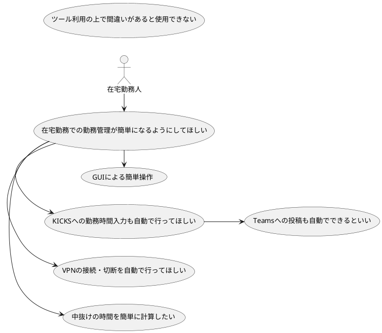
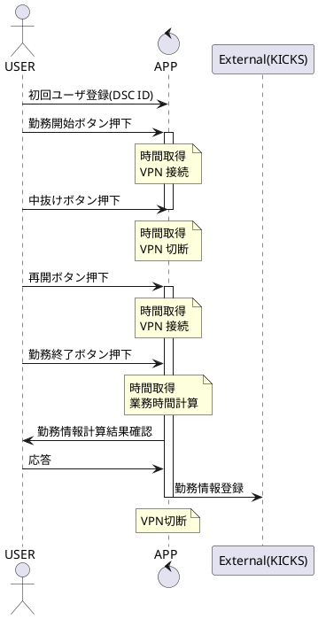
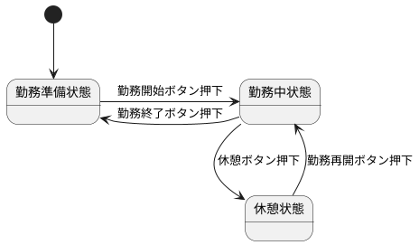
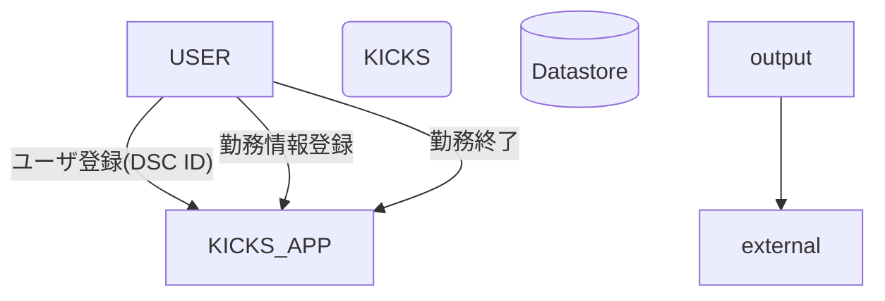

# KICKS APP design document

※勤務中状態からは休憩ボタンは押せないようにする
※休憩状態から勤務終了ボタンは・・・・現状では押せないとする
勤務再開→勤務終了の手順を踏んでもらう

## 状態遷移表

| アクション名       | アクションアイテム                                      | アクション後状態 |
| ------------------ | ------------------------------------------------------- | ---------------- |
| 勤務開始ボタン押下 | 確認 時間取得 VPN接続 ボタン切り替え                    | 勤務中状態       |
| 勤務終了ボタン押下 | 確認 時間取得 勤務終了シーケンス VPN切断 ボタン切り替え | 勤務準備状態     |
| 休憩ボタン押下     | 確認 時間取得 VPN切断 ボタン切り替え                    | 休憩状態         |
| 勤務再開ボタン押下 | 確認 時間取得 VPN接続 ボタン切り替え                    | 勤務中状態       |

勤務開始ボタン押下 ＝ 勤務再開ボタン押下

### 今の状態が横軸。各イベントで次の状態がどうなるかの表

| 次の状態       | 勤務前     | 勤務中     | 休憩中     |
| -------------- | ---------- | ---------- | ---------- |
| 勤務ボタン押下 | 勤務中状態 | 勤務前状態 | 勤務中状態 |
| 休憩ボタン押下 | 押せない   | 休憩状態   | 押せない   |

### 今の状態が横軸。各イベントで行うべきアクションが何かの表

| アクション     | 勤務前   | 勤務中   | 休憩中   |
| -------------- | -------- | -------- | -------- |
| 勤務ボタン押下 | 勤務開始 | 勤務終了 | 勤務再開 |
| 休憩ボタン押下 | -        | 休憩     | -        |

### 今の状態が横軸。各イベントでVPNに対して行うべきアクションが何かの表

| アクション     | 勤務前 | 勤務中 | 休憩中 |
| -------------- | ------ | ------ | ------ |
| 勤務ボタン押下 | 接続   | 切断   | 接続   |
| 休憩ボタン押下 | -      | 切断   | -      |

### アクションアイテム詳細

| アクションアイテム名 | 詳細                                   |
| -------------------- | -------------------------------------- |
| 時間取得             | アクション発生日時を計算しリストに格納 |
| VPN接続              | -                                      |
| VPN切断              | -                                      |
| 勤務終了シーケンス   | 別記                                   |

勤務終了シーケンス詳細

1. 時間リストを解釈し、勤務開始時間・勤務終了時間・業務時間を算出
2. ユーザに内容確認を表示
3. KICKSにPOSTし勤務情報を登録（別ファイル？に保存されたパスワード情報を利用）
4. ユーザに完了ポップアップを表示
5. リストを初期化

状態とボタンの有効について
|            | 勤務前 | 勤務中 | 休憩中 |
| ---------- | ------ | ------ | ------ |
| 勤務ボタン | 〇     | 〇     | 〇     |
| 休憩ボタン | ☓      | 〇     | ☓      |

